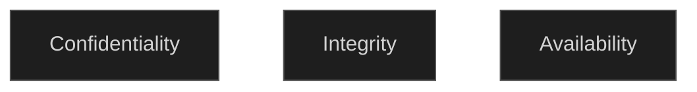
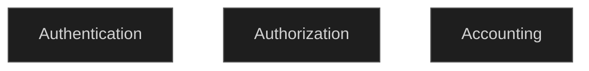

### CIA
Confidentiality, Integrity, and Availability (CIA) are fundamental concept in information and cyber security. Its like a guide for us to create policies and controls to safeguard to protect the data and resources and achieving security
> there is nothing such as **"the secure system"**, attackers always comes up with new ways to break the security, knowing that we need to keep up with all of their methods and developing new ways to protect our systems

 `Confidentiality` means that the data can not be understandable or readable for any one except those whom meant to read it. Confidentiality can be achieved  by many ways like  **encryption**. 
 Imagine Fathi want to send a message to Fadi on Whatapp, they want to make a surprise birthday party to their friend Rami, if rami can read the message the surprise is ruined, here comes the rule of confidentiality only Fathi and Fadi can see what the message contain even if Rami somehow captured the packets. 
 
 >  **Encryption** : is the process of encoding information's in a way that only authorized people can read it. Encryption does not change the content of the data, it just makes it unreadable unless you decrypt it. 
   
`Integrity` means that the data has not been changed, lost, and complete. lets say you bought a car via credit card, it coasts 10,000$, if there is no integrity 10,000 will be discounted from your account and the car dealer will receive nothing, or less than the price you paid, by that you lost 10,000 $ and the car.
   integrity can be achieved by many ways like **Hashes and Checksums**. 
   >**Hash**: is a fixed-length string of characters that is generated from input data (like a file, message, or password) using a mathematical algorithm.it's like the seal in the mail's ensures that no one changed its content. Hash usually does not mean any thing, its just like your finger print, each person have different finger print on each finger that no one else have, different data have different hash.
   
 `Availability` means that the data and/or the recourse is always available for the people that are authenticated to access, If you are hosting a website, all the users must be able to join any time, if you are hosting a banking system, users must be able to pay and receive money when ever they need, employees must be able to access company resources any time, and so on. many procedures is taken to achieve the availability we will talk about it later.

### AAA
**Authentication, Authorization, and Accounting (AAA)** is a **framework** that used to manage the **access to system resources, enforcing security policies, and tracking user activities**. This helps in protecting the system and network from unauthorized access and misuse. lets take a university as an example, students are not allowed to access the marks page with editing privilege, they can only see their marks, if that is not the case all of us will have 100%(5) GPA and that is not true.

`Authentication` Verifies the identity of a user, in other language **"who are you?"** you need to provide something that prove that you are the person that you claim you are, 
it can be :
- **something you have**: personal card, ticket, work ID ...
- **something you know**: password, PIN, answers to security questions ...
- **something you are**: finger print, voice, face ...
applying authentication makes the probabilities of someone whom not authorized to access the system very low (again there is no secure system, some one might steal the password, or the work ID ...)
	
`Authorization` Determines **what a user is allowed to do** after they have been authenticated, in other language **"what you are allowed to do after accessing the system or the network"**, by defining specific resources and actions the user can access.
   For example clients are not allowed to access the employees network, student are not allowed to change the marks. In nutshell forcing each person to access the thing that they need only, they can not access anything else.
   
`Accounting` this one is not about forcing anything, its about **tracking and monitoring user activity on the system**, what they did, how much time they spent, these information's are used for **auditing, billing, and performance analysis**. In nutshell we keep an eye on the user and the network to check if there is something wrong is going on.
For example an employee attached a USB drive in the work place, we will know and take actions. The network is abnormal, we will go and check if the traffic is legit, it might be a DOS attack. Fadi is using Rami's computer with Rami's account, an actions must be taken.

With that in mind the **CIA** and **AAA** are important in security, lets make a small example, your phone have a password that is `Authentication` and `Authorization` is granted only to you and the people that you shared your password with. when you use nick names to refer to someone in your group chat so they don't know that you are talking about them that is `Encryption` you have some `Confidentiality`, its easy once you get the hang of it.