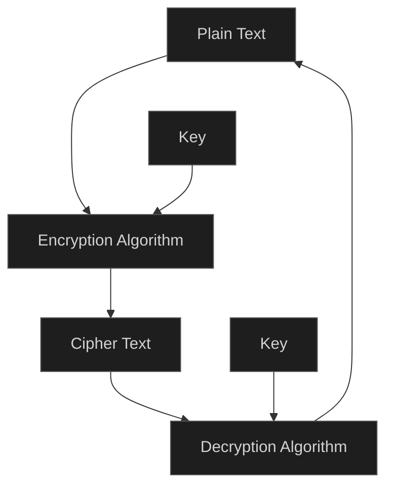

encryption is a way of converting information to secret/scrambled code that no one can read unless they have the decryption key, in an another language its a way to prevent unauthorized people from knowing what the data is by making it meaningless, its major job is to protect confidentiality.Encryption is not a modern science its been out there for thousands of years.
 to encrypt data you need three major components (the data, encryption algorithm, encryption key)
 the data can be anything from normal text, an image or a video, or a file, the encryption algorithms are used to encrypt the data using the encryption key, but how does it work? each encryption algorithm has its unique way of doing that, some needs one key to encrypt the data some needs tow (public and private) some uses long keys, some uses small keys, some uses mathematical calculations some logical or swapping. here we will discuss some of the encryption algorithms and how they work.




### Symmetric vs Asymmetric key ciphers
In `Symmetric` key encryption one key is used to encrypt the data and the same key is used to decrypt it. While `Asymmetric` encryption one key is used to encrypt the data while another key is used to decrypt it, some times it will hear (public key and private key) that means we are using asymmetric key.

the best use to symmetric algorithms are in 
- Bulk data encryption: when trying to encrypt a large amount of data due to the speed and efficiency 
- file storage: when storing files locally or globally sometimes encryption is applied, since no key exchange is needed (the key is stored locally), and to save cpu and memory usage 
- VPN's: (virtual private network) it creates a secure connection over the internet using `tunneling` (encryption) 
- in general we use the symmetric algorithms in any case that we are limited in the resources or when Asymmetric keys are not needed 


the best use to Asymmetric algorithms are in :
- Key exchange: to transfer a key, usually the Asymmetric algorithms used to exchange a key between tow parties and then the connection continue using s symmetric algorithm 
- digital signatures: A mathematical proof that a message or file was sent by a specific person and has not been altered, its used for the `accounting` in the `AAA`. (we will discuss this more in the Protocols)
- identity verification: The process of proving someone is who they claim to be, `authontecation` in the `AAA` .(we will discuss this more in the Protocols)
- messaging, web browsing, email, any sensitive data that doesn't matter the resource usage.

this does't mean its the only use or you must use it like this. it depends on the case you are in be flexible.
#### pros and cons :
1. pros 

| Symmetric                         | ASymmetric                                         |
| --------------------------------- | -------------------------------------------------- |
| fast and efficient                | slower than symmetric algorithms                   |
| low resource usage <br>(CPU, RAM) | require more resources than symmetric algorithms   |
| simple to implement               | allows secure communication without pre-shared key |

2. cons

| Symmetric                                                                      | Asymmetric                                                               |
| ------------------------------------------------------------------------------ | ------------------------------------------------------------------------ |
| Major challenge, <br>both parties must securely share and store the secret key | Public keys can be shared freely <br>but private keys must be protected  |
| low, requires a unique key for every secure connection                         | higher, one key pair per user works across all connections               |
| key can be intercepted or stolen during transmission                           | More secure for remote communication over untrusted networks             |
| Digital signatures or authentication                                           | Slower performance and larger key sizes required for equivalent security |


## simple ciphers
### Caesar Cipher
Is a one of the oldest in the book, it's based on **shifting the letters based on the key**, we decide on a key, then we **shift to the alphabet to the left based on the key**, then we re write the message based on the letter order, sounds complicated but its really simple

```
lets set the key = 3
text = 'hello world'

alphabets: 
a,b,c,d,e,f,g,h,i,j,k,l,m,n,o,p,q,r,s,t,u,v,w,x,y,z

cipher_alphabets : 
d,e,f,g,h,i,j,k,l,m,n,o,p,q,r,s,t,u,v,w,x,y,z,a,b,c
```

> now we have the cipher alphabets we can encrypt it

```
the 'h' letter in 'hello world' order is 8 we count 8 in the cipher alphabets and we replace the 'h' with it, we will get 'k'

the 'e' letter in 'hello world' order is 5 we count 5 in the cipher alphabets and we replace the 'e' with it, we will get 'h'

the 'l' letter in 'hello world' order is 12 we count 12 in the cipher alphabets and we replace the 'l' with it, we will get 'o'

we do the same for the rest of the charecters we will have
khoor zruog
```
> there is another way instead of shifting the letters manually 
```
position = (i+key) % 26
```

Caesar is simple and nice algorithm, but its a peace of cake to be broken, all what you have to do is to try the numbers from 0 to 25 and you will have the key, any number above 25 will just start looping for the same values
for example if the key was 0 or 26 it will not be encrypted and the output will be `hello world`, and if the key was 1 or 27 the cipher text will be `ifmmp xpsme` and so on 

### Vigenère Cipher
 Is a **Symmetric block cipher** similar to Caesar cipher but instead of choosing one number as the key **we decide on a keyword, then we repeat this keyword to match the plain text length**, each letter in the plain text is shifted by the alphabetical value of the corresponding letter in the key word using `c = (Pi + Ki) mod 26` .
 
 > in some cases you might have an issue where the key word is linger than the plain text. in this case we remove the extra bits/bytes 
 > example:
 > plain text `helloworld` key `key`, the plain text have 10 letters, if we repeated the key to match the length of the plain text we will end up with 9 or 12 letters, we chose the 12 letters and remove the last 2 letters 
 > `keykeykeyk`

Lets take the `helloworld` and `key` example to explain Vigenère Cipher in details
```
h|e|l|l|o|w|o|r|l|d
k|e|y|k|e|y|k|e|y|k
```
> now we take each letter with the corresponding one from the key and apply it in the formula
```
h(7) + k(10) = (r)17  
e(4) + e(4)  = (i)8  
l(11) + y(24) = (j)9  
l(11) + k(10) = (v)21  
o(14) + e(4) = (s)18  
w(22) + y(24) = (u)20  
o(14) + k(10) = (y)24  
r(17) + e(4) = (v)21  
l(11) + y(24) = (j)9  
d(3) + k(10) = (n)13  
```
>we will get `rijvsuyvjn`

>to decrypt the text we use this formula `c=(Pi-Ki)mod26`

```
r|i|j|v|s|u|y|v|j|n
k|e|y|k|e|y|k|e|y|k

r(17) - k(10) = (h)7  
i(8)  - e(4)  = (e)4  
j(9)  - y(24) = (l)11    
v(21) - k(10) = (l)11  
s(18) - e(4)  = (o)14  
u(20) - y(24) = (w)22   
y(24) - k(10) = (o)14  
v(21) - e(4)  = (r)17  
j(9)  - y(24) = (l)11  
n(13) - k(10) = (d)3  

Result:
helloworld
```

> NOTE* : in some cases when `Pi - Ki < 0 ` 
> we use this formula `c = (Pi - Ki + 26) mod 26`


### Block VS Stream cipher
are symmetric key ciphers, `Block cipher` transform the plain text to cipher text by dividing the plain text into blocks (usually 64 or 128 bit, but we will demonstrate it with letters for better visualizing)

lets take this text as an example :
- If he had anything confidential to say he wrote it in cipher

>first we divide the text to blocks with the same size (lets say 5)
`Ifheh` `adany` `thing` `confi` `denti` `altos` `ayhew` `rotei` `itinc` `ipher`

>**NOTE*** sometimes the text can not be separated to equal blocks (lets say the length of the text is 11 it have no factors) then we add padding to it to make it decidable, if we want tow letter in each box we add a letter (**x** for example) if we want each 5 letters in each box we add 4 letters (**xxxx**) and so on.
>and in the decryption we remove them 

after we made our boxes we encrypt each box using the needed algorithm with the key.

In `Stream cipher` encrypts one bit by one bit or one byte by one bit at a time. it's more suitable in real time encryption. It generates a key-stream that is combined with the plain text to the produce cipher text. 

### Asymmetric Stream Cipher
there is no `Asymmetric Stream Cipher` asymmetric algorithms are not efficient enough for streaming large or continuous data and computationally expensive that is why you wont find them in the field.

### RSA 
Is an `asymmetric Stream Cipher` that uses tow keys (public and private) usually public key means the one is used in encryption and the private means used in decryption. 
##### 1.key generation
unlike previews algorithms not any key can work, in RSA we have rules in order to create a key 
1. Chose tow prime numbers `p` ,`q`
2. calculate `n`
   `n = p * q`
3. calculate the phi(coprime):
   `φ(n) = (p - 1)*(q - 1)`
4. chose random number `e`
   `1 < e < φ(n)`
5. calculate `d`
   where `(n*d) mod φ(n) = 1`
6. the public key is (e , n)
   the private key is (d,n)
##### encryption
we calculate `c = M^e mod n` for m in message
##### decryption
we calculate `M = C^d mod n`

##### example
```
p = 5
q = 11
n = 5*11 = 55

φ(n) = (5-1)(11-1)
= 4*10 = 40

1 < e < 40
e = 3 (you can chose any number)

d = (3 * d) mod 24 = 1
d = 27 ----> (3*27)mod 40 = (81 mod 40) = 1

public key = (3,35)
private key = (24 ,35)
```
> in some rare cases you might end up with (d = e) which means that the **encryption key** is the same as the **decryption key**.

```
plain text = hello
"h" = 7
"e" = 4
"l" = 11
"l" = 11
"o" = 14

7^3 mod 55 = 343 mod 55 = 13   
4^3 mod 55 = 64 mod 55 = 9
11^3 mod 55 = 1331 mod 55 = 11
11^3 mod 55 = 1331 mod 55 = 11
14^3 mod 55 = 2744 mod 55 = 49

[13, 9, 11, 11, 25]
```

> Decryption: **M = C^d mod n**
```

13^27 mod 55 = (h)7  
9^27 mod 55  = (e)4  
11^27 mod 55 = (l)11  
11^27 mod 55 = (l)11  
49^27 mod 55 = (o)14  

hello
```

## Common encryption algorithms 
now after discussing what encryption is and how does it work, the difference between symmetric and asymmetric algorithms, let us talk about some of the famous encryption algorithms and their uses, pros and cons without getting on the details :

#### AES (Advanced Encryption Standard)
It is a **symmetric block cipher**; its the most widely used symmetric algorithm. **key size (128, 192,256) bits, block size (128 bit)**.
use cases :
- disk encryption
- vpn
- secure messaging 
- TLS(Transport Layer Security)

**Strengths**:
- Highly secure and efficient
- Supported by hardware acceleration
#### RSA (Rivest-Shamir-Adleman)
The first widely used **Asymmetric encryption system** , **key sizes (1024, 2048, 4096) bits**, its recommended to use 2048 bit key size.
use cases:
- key exchange
- digital signatures
- SSL(Secure Socket Layer)/TLS(Transport Layer Security)

**Strengths** :
- secure with large keys (hard to guess the key or brute forcing it)

**weaknesses**:
- slower than symmetric algorithms (which is not a **REAL** weakness when we talk about milliseconds or when you use it only one time while key exchange 😑)

> Fun fact : the name is taken from the name's of the creator's of the algorithm `Ron Rivest, Adi Shamir, and Leonard Adleman` bad naming in my opinion 

#### DES(Data Encryption Standard) and 3DES
**DES** is a block symmetric key algorithm. it was widely used encryption method but is now considered outdated due to its short key length.

**3DES** Applies DES cipher three times to each data block (short key issue solved :P )
**key size 168 bit (three 56 bit keys)**
**use cases** :
- Legacy systems
- older banking applications

**Weaknesses**:    
- Considered deprecated; slower and less secure than AES

> `deprecated` considered outdated and is no longer recommended for use, it may be still working(functional) but not recommended (**discouraged**) to use due to (**concerns about security vulnerabilities, performance issues, or the availability of better alternatives**)

